# Challenge - School District Analysis

## Challenge - Overview

We are tasked with preparing standardised test data for analysis, reporting, and presentation to provide insights about performance trends and patterns. We were given a dataset of schools in the district as well as a dataset of students at those schools and their corresponding math and reading test scores. We had to aggregate the data and look for trends in school performance based on a variety of categories.

We want to look at the math and reading scores and the passing rates, and look for trends based on school type, budget, size, and grades (schooling years). We would take the data and sort it into the chosen categories and group by our chosen ranges. This analysis will assist the school board and superintendent on making decisions regarding the school budgets and priorities.

For the challenge part of the analysis we looked at how removing Thomas High School's 9th Grade math and reading scores would affect the analysis. Evidence of academic dishonesty shows that these scores appear to have been altered. Although the extent of this issue the school board wishes to uphold state-testing standards and have come to us for help. We compare the same categories mentioned above after removing the scores, and look to see where the biggest changes are.

## Context - Version 1 and 2

I ran through this challenge twice over with different methodology. In the first version I put together I used the DataFrame where after replacing the 9th grader's scores we updated it to only include the percentage of passing students from the 10th, 11th, and 12th grade - (this was DELIVERABLE 2). When I performed the analysis this way I saw very little in the way of notable changes in comparing the results with the original module. I still worked through it and provide my results below, however I felt like my summary was lacking.

I revisited the challenge and in the second version I used the summary DataFrame where the 9th grader's scores have been replaced but we haven't updated it to only take into account the 10th, 11th, and 12th grader's passing scores. By running the same analysis on this DataFrame I was able to get more noticeable changes that I write about in the Version 2 Summary below.

If this was an analysis I was putting together for a client this would be the moment I returned these findings to them and ask for clarity over which set of results they would like to proceed with. For that reason I leave both Versions of my analysis here, in the hopes my methodology becomes clear. I understand the reasoning behind analysing both versions, the first as it means we are looking at the student's achievements at the school despite the cheating grade. And the second as it paints a more realistic picture of the results of having to disqualify the cheaters and the effects it would have on the school's standings compared to the rest of the district.

# Version 1

## Challenge Version 1 - Results

### How is the district summary affected?

The district summary from the module work is shown below:

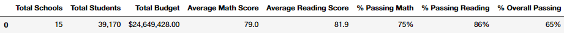

And the district summary from the challenge:

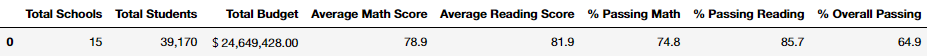

As you can see from the two summaries, removing one school's reading and math scores from only one grade has little effect. This is because we're dealing with a huge number of students (39,170) from 15 schools - one grade just cannot have a large impact. However, there are some minor changes, for example the **Average Math Score** has decreased by one tenth.

### How is the school summary affected?

The school summary from the original module also tells a similar story as the district summary - that there wasn't a great change. However, the interesting part of the analysis comes from the percentage of passing students before and after removing the scores. Here is the school summary after the 9th Grade students of THS have their scores removed (changed to `NaN`):

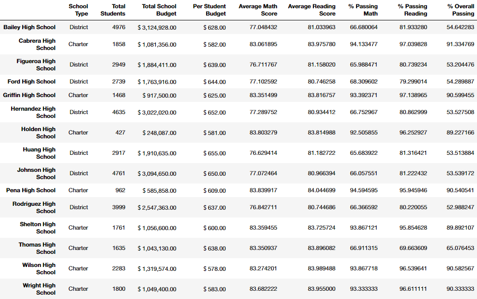

And here is the school summary after we correct the student count and take into account that we removed scores for Thomas High School:

Here we can plainly see that after changing the 9th grader's scores to `NaN` without correcting the legitimate student count, Thomas High Score performs poorly in the passing percentage of math and reading. This is important to note, as without changing this we belittle the achievements of the rest of THS - we aren't taking into account that the other students are producing good passing percentages. These are by far the most noticeable changes, and something one would be well suited to keep in mind when cleaning data in the future.

### How does replacing the ninth graders’ math and reading scores affect Thomas High School’s performance relative to the other schools?

Before removing the scores, we can see that THS was the second best performing school:

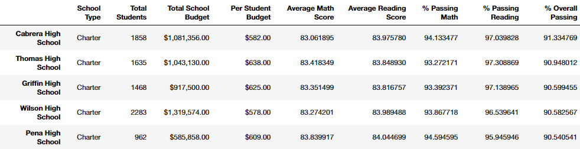

And after we removed the scores and corrected for school size, we can see that THS is still the second best performing school:

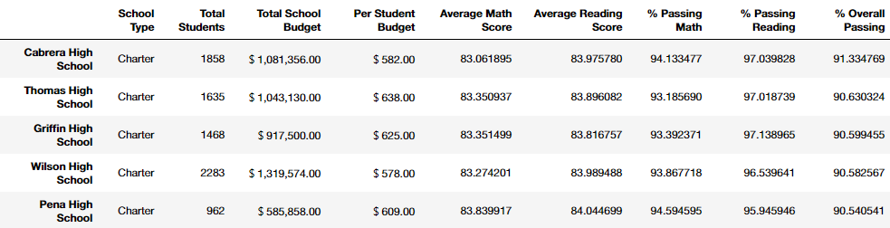

There is a slight decrease in the passing percentages but not enough to bump them out of first place. We can quickly conclude here that the rest of THS performs well, even if the legitimacy of the ninth grade is called into question.

### How does replacing the ninth-grade scores affect the following:

**Math and Reading Scores by Grade:**

Here we can see the math scores by grade and then the reading scores by grade grouped by the individual schools in the district:

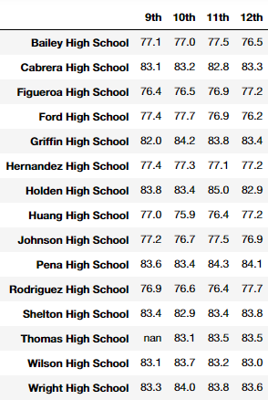

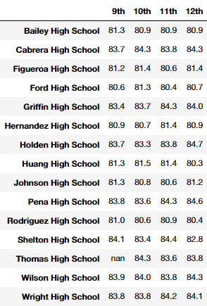

The major change is the missing data. (Obviously the tenth, eleventh, and twelfth grade scores would be unaffected by the removal of the ninth grade scores.) The missing data is the result of us choosing to simply remove the scores rather than try to change them to more accurate scores, or handling this data cleaning in a different way. We could have chosen to take the averages of the other schools falling in similar categories and substituted that data in rather than removing it, but that's a point for a different analysis.

**Scores by School Spending:**

The schools and scores sorted by spending from the module:

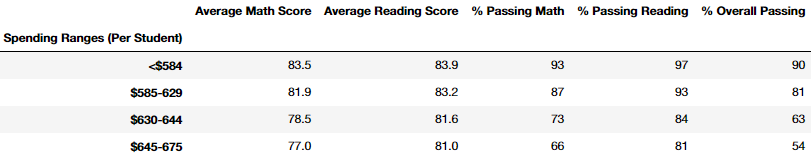

And the schools and scores sorted after removing THS ninth graders scores:

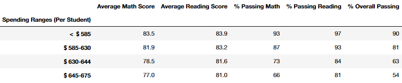

As we can see there is no change.

**Scores by School Size:**

From the module, by school size:

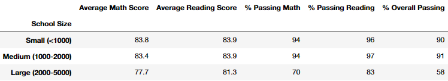

From the challenge, by school size:

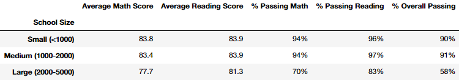

Again, there is no change.

**Scores by School Type:**

From the module, by school type:

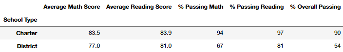

From the challenge, by school type:

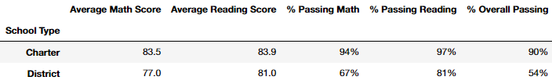

And once again, there is no change.

The lack of changes in these categories suffer from the same issues broached in the district school summary above: removing one grade's scores from one school of the 15 in the district just simply won't have as grand an effect. This is unfortunate as it means we aren't able to analyse the true meaning of removing the scores. The next step would be looking into the individual school, or seeing how a whole school's scores being nullified would effect this analysis.

## Challenge Version 1 - Summary

We really only saw **four** major changes during this analysis after the cheating changes:
- Per School Summary - % Passing Math
- Per School Summary - % Passing Reading
- Per School Summary - % Overall Passing
    - We had to take into account the real number of student scores before we could get an accurate analysis.
- Math and Reading Scores by Grade
    - Here we saw what the lack of data would do to our set, when missing a whole cell of the summary.

# Version 2

## Challenge Version 2 - Results

### How is the district summary affected?

This comparison is the same as Version 1, as we haven't yet changed the school summary to not include any 9th graders in the subject passing percentages. So, the district summary from the module work is shown below:

And the district summary from the challenge:

As you can see from the two summaries, removing one school's reading and math scores from only one grade has little effect. This is because we're dealing with a huge number of students (39,170) from 15 schools - one grade just cannot have a large impact. However, there are some minor changes, for example the **Average Math Score** has decreased by one tenth.

### How is the school summary affected?

The school summary is effected heavily by the removal of the ninth grader's scores from Thomas High School. The passing percentages for THS have decreased immensely, as would be expected when you essentially look at zero-ing a large portion of one school's results, and also when their original scores were so high.

As we can see the passing percentages for Math, Reading, and Overall have dropped from the original:

|                    | % Passing Math | % Passing Reading | % Passing Overall |
|               ---: |     :---:      |       :---:       |       :---:       |
| % Passing Before   | 93.3%          | 97.3%             | 90.9%             |
| % Passing After    | 66.9%          | 69.7%             | 65.1%             |

This is a dramatic change and one that would certainly effect any decision made about the school in the future by the school board.

### How does replacing the ninth graders’ math and reading scores affect Thomas High School’s performance relative to the other schools?

Before removing the scores, we know that Thomas High School was the second best performing school, after removing the ninth grader's schools and running this same analysis we can see the new top 5 schools:

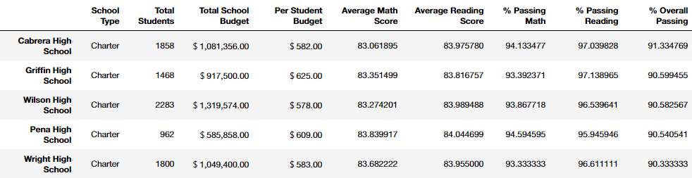

And we can also consider the bottom 5 schools:

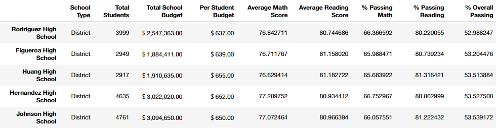

Thomas High School no longer makes an appearance in either of these lists of five, meaning it has dropped from second place but is still doing better than some of the other schools in the district. This is more proof that the other students in the 10th, 11th, and 12th grades are still performing at a high standard and that the money being invested into these students is having good results.

### How does replacing the ninth-grade scores affect the following:

**Math and Reading Scores by Grade:**

Here we can see first the math scores by grade and then the reading scores by grade for all the schools. This is the same result as in Version 1 as this part of the analysis is looking only at the average scores per grade rather than the total passing percentages of the schools.

The missing data is the result of us choosing to simply remove the scores rather than try to change them to more accurate scores, or handling this data cleaning in a different way. We could fill in the ninth graders scores by taking an average of the tenth, eleventh, and twelfth and using that as a guide to scores the ninth graders may produce. Again this is another question for another analysis.

**Scores by School Spending:**

The schools and scores sorted by spending from the module:

And the schools and scores sorted after removing THS ninth graders scores:

Here we see that the bin that Thomas High School fits into (＄630-644) has seen a large change, with the % Passing Math decreasing by 6%, the % Passing Reading decreasing by 7%, and the % Overall Passing also decreasing by 7%. The removal of a grade's scores has drastically effected the analysis results when we have divided the schools into spending ranges. When seeing these results you wouldn't be mistaken in thinking it was better to invest less money per student into the schools to fit into the ＄585-630 range ad they are returning better passing rates.

**Scores by School Size:**

From the module, by school size:

From the challenge, by school size:

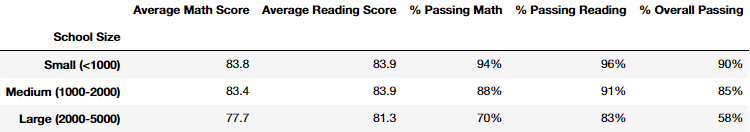

Again we see a large change in the range that Thomas High School falls in: 1000-2000 students. The % Passing Math, the % Passing Reading, and the % Passing Overall have all decreased by 6%. With the school spending analysis we saw that removing the ninth grader's scores effected the range enough that you could make an argument for spending less and getting better results. That isn't the case here though, where although we've see a great decline in the passing rates they stall fall in line in between the school sizes. The initial sizing analysis tells us that smaller schools perform better and after removing the ninth grader's scores this statement still holds true.

**Scores by School Type:**

From the module, by school type:

From the challenge, by school type:

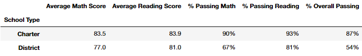

Thomas High School is a Charter school so again we see the effect in the bin that the school falls into. The % Passing Math and the % Passing Reading has decreased by 4%, while the % Overall Passing has decreased by 3%. Like the School Size analysis though there is no change in the idea that the Charter schools perform better than the District schools, this is still a verifiable fact.

## Challenge - Summary

We saw **four** major changes during this analysis after the cheating changes:
- Top 5 Schools by Overall Passing %: Thomas High School fell from second place to barely being above the bottom 5.
- Scores by School Spending: the % Passing Math decreased by 6%, the % Passing Reading decreased by 7%, and the % Overall Passing also decreased by 7%.
- Scores by School Size: the % Passing Math, the % Passing Reading, and the % Passing Overall have all decreased by 6%.
- Scores by School Type: % Passing Math and the % Passing Reading has decreased by 4%, while the % Overall Passing has decreased by 3%.

## Context

This is the result of Module 4 of the University of Toronto School of Continuing Studies Data Analysis Bootcamp Course. Following the guidance of the module we end up pushing this selection of files to GitHub.

_I personally was confused which DataFrame we should be using for the analysis, hence me repeating it twice using two different ones. I hope I have explained my thinking/reasoning clearly and would greatly appreciate feedback on which direction was the sought after one._
